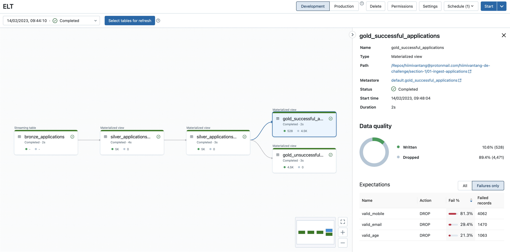

# Section 1: Data Pipelines

## Key considerations

1. Need to enforce data quality checks to differentiate valid applications from unsuccessful ones.
2. Must be able to differentiate different date formats and represent all birth dates in a standardised format.
3. Ensure exactly-once-semantics when ingesting and processing user applications.
4. Address the possibility where membership ID is the same due to two different applicants having the same last name and birth date.
5. Ensure pipeline code is simple and easily maintainable. 


## Solution

With the abovementioned considerations, we require:
* An ingestion pipeline that can incrementally and efficiently process user applications. 
* Ability to define expectations on the data ingested.
* Ability to identify records that fail data quality validations.
* A workflow orchestration tool for scheduling and running various tasks of the pipeline. 

I've decided to use Databricks platform for the development and deployment of the data pipeline. 

Delta Live Tables, a framework for building reliable, maintainable, and testable data process pipeines, allows me to:
* Define [expectations](https://docs.databricks.com/workflows/delta-live-tables/delta-live-tables-concepts.html#expectations) to specify data quality controls on the user applications easily.
* Leverage [Databricks Auto Loader](https://docs.databricks.com/ingestion/auto-loader/index.html#what-is-auto-loader) to incrementatlly and efficiently ingest user applications, avoiding any reprocessing when running the pipeline the second time. 
* Build data pipelines declaratively using just [SQL](https://docs.databricks.com/workflows/delta-live-tables/delta-live-tables-sql-ref.html).
* Automatically detect dependencies between tables.

In addition, Databricks Workflows, a fully-managed orchestration service, allows me to easily schedule my data pipeline which consists of the following tasks:
1. Ingest, validate, and process user applications 
2. Output successful and failed applications into a separate bucket/folder.


## Data pipeline topology



## Data pipeline code

See below for the full Delta Live Tables pipeline code, written in SQL only. 

By just using cloud_files() function, we are telling DLT to use Auto Loader to incrementatlly ingest data from the specified path.

```


CREATE OR REFRESH STREAMING LIVE TABLE bronze_applications
AS SELECT * FROM cloud_files("/mnt/hiimivantang-private-bucket/membership_applications", "csv", map("cloudFiles.inferColumnTypes", "true", "header", "true"))

```

[](https://asciinema.org/a/dQr2DZORIgvI9ZdZAgggNAFUw)

After inspecting the user applications dataset, I have identify the FOUR possible date formats for the `birth_date` column: 

1) yyyy-MM-dd: `^[0-9]{4}\-[0-9]{2}\-[0-9]{2}$`
2) dd-MM-yyyy: `^[0-9]{2}\-[0-9]{2}\-[0-9]{4}$`
3) MM/dd/yyyy: `^[0-9]{2}\/[0-9]{2}\/[0-9]{4}$`
4) yyyy/MM/dd: `^[0-9]{4}\/[0-9]{2}\/[0-9]{2}$`


I'm creating the second table that uses the previous table as the source, split name into first name and last name, and finally standardize `birth_date` column.

```
CREATE OR REFRESH LIVE TABLE silver_applications_prepared
AS SELECT name, 
split(name, ' ')[0] as first_name,
split(name, ' ')[1] as last_name, 
email,
CASE WHEN date_of_birth regexp '^[0-9]{4}\-[0-9]{2}\-[0-9]{2}$' THEN to_date(date_of_birth, 'yyyy-MM-dd')
WHEN date_of_birth regexp '^[0-9]{2}\-[0-9]{2}\-[0-9]{4}$' THEN to_date(date_of_birth, 'dd-MM-yyyy') 
WHEN date_of_birth regexp '^[0-9]{2}\/[0-9]{2}\/[0-9]{4}$' THEN to_date(date_of_birth, 'MM/dd/yyyy')
WHEN date_of_birth regexp '^[0-9]{4}\/[0-9]{2}\/[0-9]{2}$' THEN to_date(date_of_birth, 'yyyy/MM/dd') ELSE NULL END as parsed_date_of_birth,
mobile_no
from live.bronze_applications;

```

Next, I'm creating the third table that uses the previous table as the source, and further enrich it the derived membership_id, email validity, mobile number validity, and whether applicant is above 18 as of 2022-01-01.

```
CREATE OR REFRESH LIVE TABLE silver_applications_prepared_enriched
SELECT 
concat(last_name, '_', substring(sha2(date_format( parsed_date_of_birth, 'yyyyMMdd'), '256'), 0, 5)) as membership_id,
name,
first_name,
last_name,
date_format(parsed_date_of_birth, 'yyyyMMdd') as date_of_birth,
email,
mobile_no,
parsed_date_of_birth <= (DATE'2022-01-1' - INTERVAL '18' YEAR) as above_18,
email regexp '^.*@.*(.com|.net)' as valid_email,
mobile_no regexp '^[0-9]{8}$' as valid_mobile
from live.silver_applications_prepared
```

Lastly, I'm defining expectations for the successful applications table, ensuring that only applicants with valid email, valid mobile number, and is above 18 years old as of 2022-01-01.
Also, unsuccessful applicants are saved in a separate table.

```
CREATE
OR REFRESH LIVE TABLE gold_successful_applications(
  CONSTRAINT name_not_null EXPECT (name IS NOT NULL) ON VIOLATION DROP ROW,
  CONSTRAINT valid_age EXPECT (above_18 IS TRUE) ON VIOLATION DROP ROW,
  CONSTRAINT valid_email EXPECT (valid_email IS TRUE) ON VIOLATION DROP ROW,
  CONSTRAINT valid_mobile EXPECT (valid_mobile IS TRUE) ON VIOLATION DROP ROW
) AS
SELECT
  *
FROM
  live.silver_applications_prepared_enriched


CREATE
OR REFRESH LIVE TABLE gold_unsuccessful_applications AS
SELECT
  *
FROM
  live.silver_applications_prepared_enriched
WHERE
  name IS NULL
  OR NOT above_18
  OR NOT valid_email
  OR NOT valid_mobile
```


## Output files

Output files are being generated and saved in a S3 bucket. For convenience, I've committed those files into this git repository and can be found here:
* [./output/successful_applications.csv](./output/successful_applications.csv)
* [./output/failed_applications.csv](./output/failed_applications.csv)
