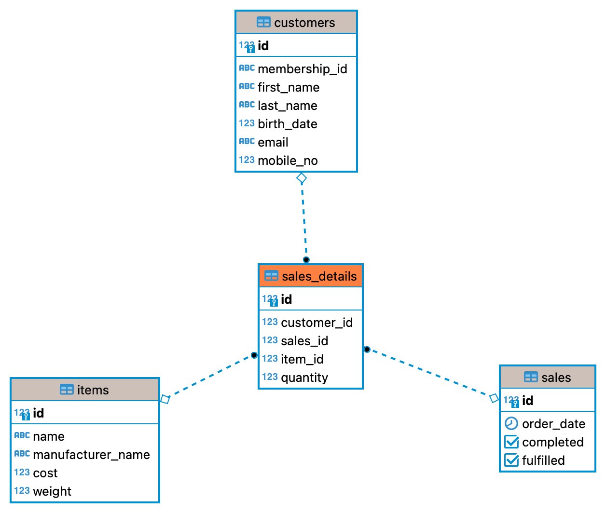
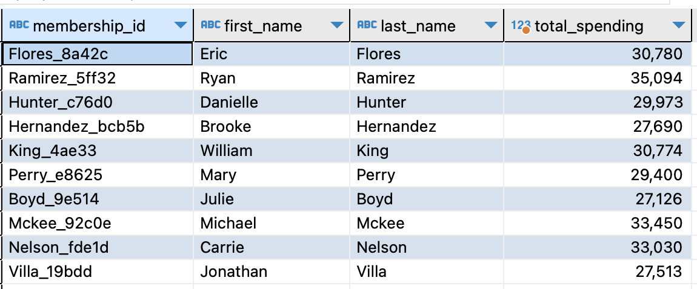
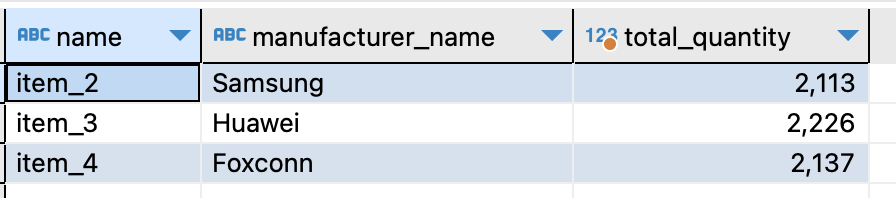

# Section 2: Databases

## Star Schema

Adopting a star schema to organize the data in the database ensures that is easy to understand and analyze.

At the center of the Star Schema is our fact table, which in our case is the `sales_details` table stores the line items for each transaction, i.e. one transaction can consist of multiple records in `sales_details` table.

Surrounding the fact table are the dimension tables that store descriptive information for all related fields in the `sales_details` fact table. Here are the 3 dimension tables: 
1. `customers` - Contains customer related information such as membership id, name, birth date, email address, and mobile number.
2. `items` - Contains price, weight, and manufacturer information for each individual item,
3. `sales` - Contains transaction timestamp, and whether transaction is completed and fulfilled. 




### DDL statements and mock data

The DDL statements for the creation of schemas, tables, users, and groups are written in the `ddl_statements.sql` file. This file will be copy into the `/docker-entrypoint-initdb.d/` directory of Postgres docker container and will be executed as soon as the container is starter.

In addition to the DDL statements, `ddl_statements.sql` also contain INSERT statements for creating mock data for our Proof of Concept (POC).


### Which are the top 10 members by spending?

See below for the sample queries and results based on the Proof of Concept. 

```
with top_spenders as (
with s as(
select
  *,
  quantity * cost as costs
from
  sales_details
inner join items on
  sales_details.item_id = items.id)
select
  customer_id,
  sum(costs) as total_spending
from
  s
group by
  customer_id
order by
  total_spending desc
limit(10)
)
select
  customers.membership_id,
  first_name,
  last_name,
  total_spending
from
  top_spenders
inner join customers on
  customers.id = top_spenders.customer_id
```




## Which are the top 3 items that are frequently bought by members
```
with frequent_items as(
with s as(
select
  *
from
  sales_details
inner join items on
  sales_details.item_id = items.id)
select
  item_id,
  sum(quantity) as total_quantity
from
  s
group by
  item_id
order by
  total_quantity desc
limit(3))
  select
  items.name,
  items.manufacturer_name,
  total_quantity
from
  frequent_items
inner join items on
  items.id = frequent_items.item_id
```


