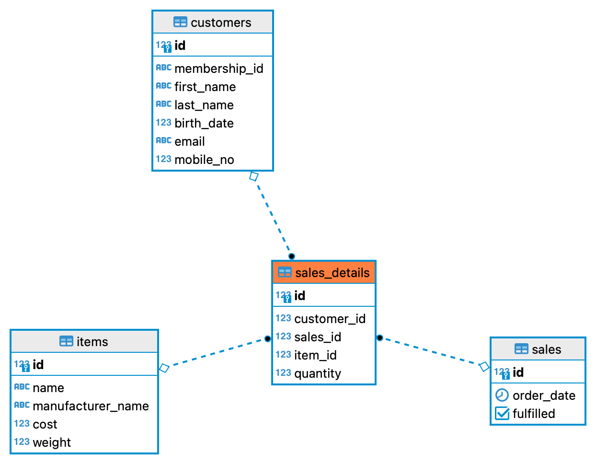

## Which are the top 10 members by spending?

```
with top_spenders as (
with s as(
select
  *,
  quantity * cost as costs
from
  sales_details
inner join items on
  sales_details.item_id = items.id)
select
  customer_id,
  sum(costs) as total_spending
from
  s
group by
  customer_id
order by
  total_spending desc
limit(10)
)
select
  customers.membership_id,
  first_name,
  last_name,
  total_spending
from
  top_spenders
inner join customers on
  customers.id = top_spenders.customer_id
```


## Which are the top 3 items that are frequently bought by members
```
with frequent_items as(
with s as(
select
  *
from
  sales_details
inner join items on
  sales_details.item_id = items.id)
select
  item_id,
  sum(quantity) as total_quantity
from
  s
group by
  item_id
order by
  total_quantity desc
limit(3))
  select
  items.name,
  items.manufacturer_name,
  total_quantity
from
  frequent_items
inner join items on
  items.id = frequent_items.item_id
```
