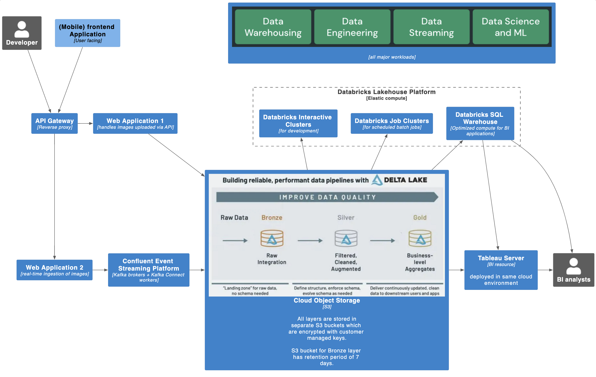
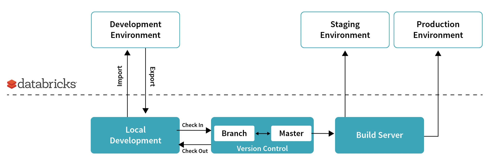

# Section 3: System Design

## Design 1

### Implementing Role-Based Access Control for Logistics, Analytics, and Sales teams.

In order to allow different team members to perform different operations on the database, first we need to create groups within Postgres. This allows us to grant privileges at the group-level as opposed to granting it laboriously one user at a time. The following groups are created in Postgres:
1. Logistics
2. Analytics
3. Sales

`SELECT` privileges are granted to all the 3 groups. 

In order to avoid corrupting the database by unnecessary writes from unauthorized users, I have restricted `INSERT` and `UPDATE` to only the relevant teams as shown below.

### Slowly Changing Dimensions (SCD)

Simply deleting records of old items from the `items` table will result in unreferenced keys in the `sales_details` table and ultimately inability to derive insights such as those stated in section 2. 

In order to safely remove old items or update items in the `items` table, you need to adopt SCD management methologies. SCD Type 2 is recommemnded as unlimited historical data is preserved for each insert. For example, you can use an `effective date` and a `current flag` columns for differentiating the current version. In addition, the `effective date` column can be used to join with the correct item based on the transaction date in `sales_details` table.

---

## Design 2 

## System Architecture
The system architecture diagram depicts a pattern is cloud-agnostic and can be easily deployed and repeated on ANY cloud provider. 

This architectural pattern is based on various open source projects and open storage formats such as:
* Apache Kafka
* Apache Spark
* Mlflow
* Delta Lake

The following are the core components required for end-to-end image processing pipeline:

1. API Gateway
2. Web Application 1
3. Web Application 2
4. Confluent Event Streaming Platform
5. Data Lake (Cloud Object Storage)
6. Databricks Lakehouse Platform

## Securing access to the environment and its resources as the company expands

The following are three key strategies in ensuring secure access to the environment as the company expands.

### Automate user provisioning with SCIM

As the company expands, there will be many different teams that require different resources within the environment. 
Instead of manually provisioning new users within Databricks Lakehouse Platform, you can leverage SCIM (System for Cross-domain Identity Management) to synchronize user and groups between your IdP (e.g. Active Directory) and Databricks. 

### LDAP-based authentication

Most companies has an LDAP identity provider (IdP) such as Active Directory which stores information about objects and users on its network. 

In AWS, you can integrate your AD with AWS IAM Identity Center (previously known as AWS SSO) with an AD Connector.

By integrating Databricks with AWS IAM Identity Center, users can use their corporate credentials to sign in to platform instead of having to sign in separately. 
This elimiates the need to create another set of identity and password hence reducing both the attack surface and the risk of data exfiltration.

### Policy-based access control (PBAC)

Policy-based Access Control is an access control strategy uses roles and attributes (e.g. LDAP attributes) of users to determine whether they should see certain data.

By adopting solutions that provide PBAC, you can automate granting of privileges/permissions to users.

Immuta is one vendor that provides PBAC and [integration with Databricks](https://documentation.immuta.com/SaaS/prologue/about-immuta-platform/data-access-patterns/databricks/databricks/). 

## Security of data at rest and in transit

### Encryption of data at rest with customer-managed key

Amazon S3 automatically encrypt all new objects added on buckets on server side, using AES-256 by default.

However, it is still recommended to configure S3 to perform server-side encryption using customer-managed key.
This provides you the ability to rotate, enable and audit the encryption key used to protect your data.
In event of your key being compromise, you will be able to destroy the key and effectively preventing any access to your data.

### Wire Encryption

As Apache Kafka communicates in PLAINTEXT by default, you can configure all brokers in your Kafka clusters and other Confluent components to use TLS/SSL encryption. 
This ensures all communication between the components and Kafka clients are encrypted.

By default, user queries and transformations are typically sent to your Databricks clusters over an encrypted channel. 
However, traffic exchanged between worker nodes in a Databricks cluster is not encrypted. 
You can create an init script that configures your clusters to encrypt traffic between worker nodes, using AES encryption over a TLS 1.2 connection.

## Scaling to meet user demand while keeping costs low

### Decoupled storage and compute

Decoupling storage and compute allows you to scale both independently.

In our proposed system architecture, we are leveraging Amazon S3 (cloud object storage) and Delta Lake (an open data format) as our storage layer.
S3 bring infinite storage with cost efficiency as you are only paying for what you store.
On top of that, by using Delta Lake as the primary data format brings reliability and performance to your data lake.

Databricks fully-managed clusters provide on-demand and massively parallel processing (MPP) compute that can automatially scale up or down according to workloads.
By not overprovisioning for peak workloads and only paying for what you use, the total costs of ownership (TCO) will be reduced.

## Maintainance of the environment and assets (including processing scripts)

### GitOps and IaC

By adopting Infrastructure as Code (IaC) approach in provisoning and managing infrastructure, you can ensure that your environment(s) become versionable, testable, and repeatable.
One option is to use Terraform, a stateful application that keeps track of everything it builds in your cloud environment.
If you need to change something or delete something later, Terraform will know what it build, and it can go back and make incremental changes for you.

Combining IaC with GitOps, an operational framework that takes DevOps best practices used for application development, allows you to automate infrastructure maintenance.

### Source code management and CI/CD

With version control, we are enabling everybody to easily find, reuse, and propose changes to any part of the codebase. This in turn provides faster delivery, higher level of stability and availability, and higher code quality.

Implementing CI/CD will enable you to release on a more frequent basis without compromosing on quality.
With CI/CD, code changes are shepherded through an automated pipeline that handles the repetitive build, test and deployment tasks and alerts you about any issues.
This makes maintenance of your production processing scripts much easier and results in more reliable data pipelines. 

## Architectural decsisions, characteristics, and postive outcomes

The architectural decisions made are mainly based on the following core principles:
1. A common landing zone for all data
2. Single source of truth for powering all workloads
3. Embrace open source technologies and avoid data lock-in 
4. Use platforms not tools
5. Information security as the key priority

| Architectural decisions                                                     | Resulting characteristics                                                     | Positive outcomes                                                                                                                                                                                                                                                                                                                                                                                                                                                                                                                                                                                                                                                                                                                                                                                                                                                                                                                                                                                                                 |
| --------------------------------------------------------------------------- | ----------------------------------------------------------------------------- | --------------------------------------------------------------------------------------------------------------------------------------------------------------------------------------------------------------------------------------------------------------------------------------------------------------------------------------------------------------------------------------------------------------------------------------------------------------------------------------------------------------------------------------------------------------------------------------------------------------------------------------------------------------------------------------------------------------------------------------------------------------------------------------------------------------------------------------------------------------------------------------------------------------------------------------------------------------------------------------------------------------------------------- |
| API gateway sitting between clients and a collection of web applications    | Scalability Reliability                                                    | API gateway provides load balancing and can handle increasing concurrent requests to web applications.  In additon, most API gateway has automatic failover capabilities and web applications can remain accessible even during AZ and region outages.                                                                                                                                                                                                                                                                                                                                                                                                                                                                                                                                                                                                                                                                                                                                                                      |
| Use Kafka Connect and Delta Lake sink connector                             | Scalability                                                                   | Kafka Connect allows a no-code and scalable approach to consuming and sinking events from your Kafka cluster. In the event where other sinks are required, there is an abundance of Kafka Connectors available.                                                                                                                                                                                                                                                                                                                                                                                                                                                                                                                                                                                                                                                                                                                                                                                                                   |
| Decoupled storage and compute                                               | Scalability Lower TCO                                                      | Ability to scale storage and compute independently and avoid overprovisioning for peak workload.                                                                                                                                                                                                                                                                                                                                                                                                                                                                                                                                                                                                                                                                                                                                                                                                                                                                                                                                  |
| Adopting Delta Lake on cloud object storage such as S3                      | Scalability Low latency Maintainability Reliability Extensability | As data grows, metadata operations on cloud object storage will experience poor performance. Delta Lake use a transaction log that is compacted into Apache parquet format to provide significantly faster metadata operations for large datasets (e.g. the ability to quickly search billions of table partitions for those relevant to a query)  A Delta table can be both a streaming source/sink as well as a batch table at the same time. This reduces the overall end-to-end latency from ingestion to insight.  Delta lake provides schema evolution and this allows you to automatically keep up with changing data schemas, avoiding the need to recreate a table with new schema and copying existing data over.  Data reliability is improved thanks to the ability to enforce data quality, constraints, and also ACID transactional guarantees on your tables in Delta Lake.  Delta Lake tables can be accessed from Apache Spark, Hive, Presto, Redshift, Presto, Trino and other systems. |
| Using Kafka Consumer and/or Streams API for sub-second latency requirements | Low latency                                                                   | You can implement a Kafka client that uses Kafka Consumer / Streams API to process and analyze data from Kafka topics. This will result in extremely low latency as you will be able to process data as soon as it is being produced into a Kafka topic.                                                                                                                                                                                                                                                                                                                                                                                                                                                                                                                                                                                                                                                                                                                                                                          |
| Using Databricks for its fully-managed, on-demand and auto-scaling compute. | Maintainability                                                               | Databricks provides fully-managed compute that can auto-scale up and down based on your workloads.                                                                                                                                                                                                                                                                                                                                                                                                                                                                                                                                                                                                                                                                                                                                                                                                                                                                                                                                |
| Use CI/CD tooling                                                           | Realiability Fault tolerance                                               | Using CI/CD tooling such as Git, Jenkins, Github Actions, and etc, allows developers to continuously perform testing, integration, and deployment. This results in agility, faster turnaround time, and a more reliable data pipelines.  In addition, you can use CI/CD tooling to push changes to both primary and secondary site, allowing you the ability to failover to the secondary site during outages.                                                                                                                                                                                                                                                                                                                                                                                                                                                                                                                                                                                                              |
| LDAP based authentication                                                   | Security                                                                      | Both Confluent and Databricks platform can be configured to authenticate against LDAP-baesd identity provider such as Active Directory, avoiding the need to seperately maintain as set of security principals in individual components/platforms for authentication.                                                                                                                                                                                                                                                                                                                                                                                                                                                                                                                                                                                                                                                                                                                                                             |
| Adopting role-based access control (RBAC)                                   | Security Principle of Least Privilege                                      | Both event streaming platform and Databricks support role-based access control, allowing you to restrict access based on a person's role within an organization. For example, you can configure different level of permissions on notebooks, ML models, clusters, jobs, data pipelines, dashboards, queries, and etc.                                                                                                                                                                                                                                                                                                                                                                                                                                                                                                                                                                                                                                                                                                             |
| Using customer-managed keys for encryption of data at rest                  | Security                                                                      | Although S3 by default encrypts all data (as announced on 6th Jan 2023), the use of customer-managed key provides an option for you to destroy the key in the event when the key is being compromised. This minimizes the risk of data exfiltration.                                                                                                                                                                                                                                                                                                                                                                                                                                                                                                                                                                                                                                                                                                                                                                              |
| Ensuring wire encryption                                                    | Security                                                                      | As Apache Kafka communicates in PLAINTEXT by default, you can configure all brokers in your Kafka clusters and other Confluent components to use TLS/SSL encryption. This ensures all communication between the components and Kafka clients are encrypted.  By default, user queries and transformations are typically sent to your Databricks clusters over an encrypted channel. However, traffic exchanged between worker nodes in a Databricks cluster is not encrypted. You can create an init script that configures your clusters to encrypt traffic between worker nodes, using AES encryption over a TLS 1.2 connection.                                                                                                                                                                                                                                                                                                                                                                                          |
| Use AWS Privatelink                                                         | Security                                                                      | You can enable AWS PrivateLink on your Databricks workspace to provide private connectivity from AWS VPCs and on-premise networks to Databricks without exposing the traffic to the public (internet) network.                                                                                                                                                                                                                                                                                                                                                                                                                                                                                                                                                                                                                                                                                                                                                                                                                    |

