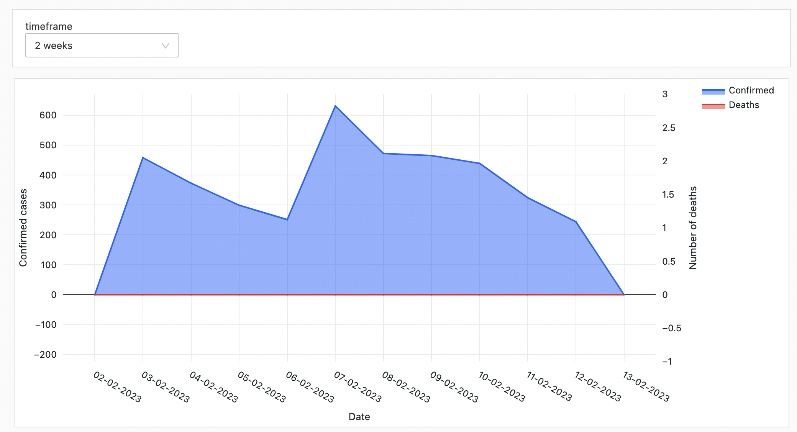
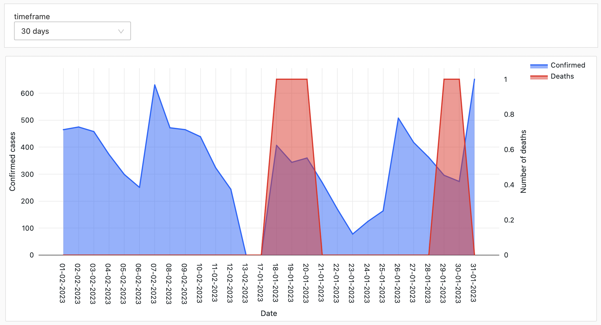
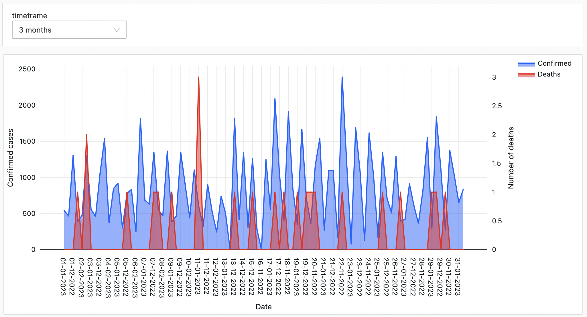
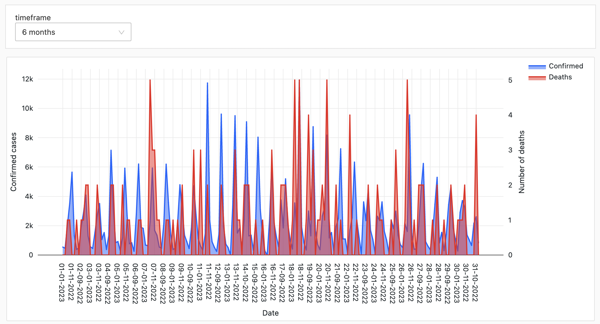
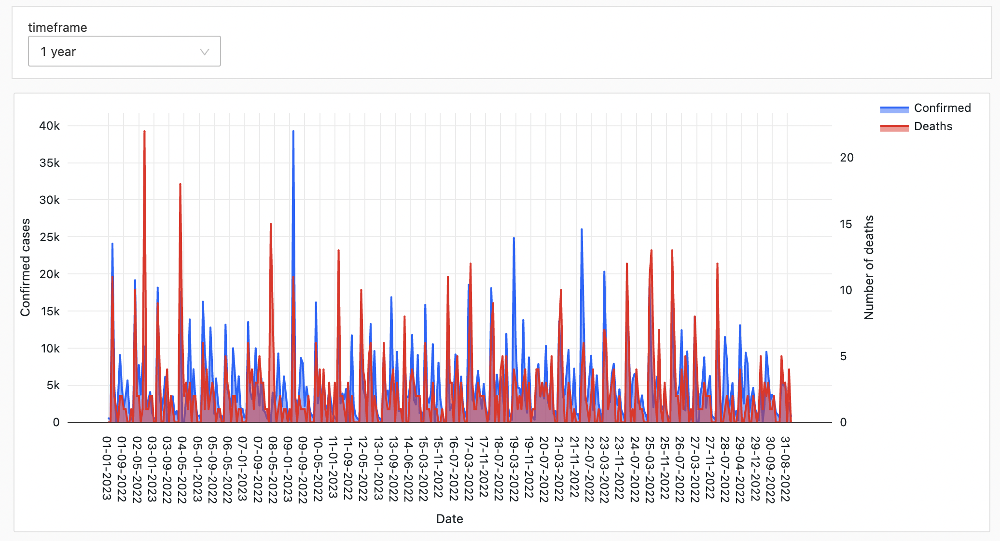
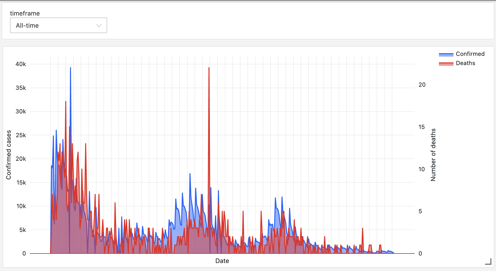

# Section 4: 

Steps to recreate the charts: 
1. Download the data by running the following command: 
`wget https://api.covid19api.com/country/singapore`

2. Upload the json output from the previous step into Databricks DBFS

3. Run the following code to create the dataframe from the JSON file and create a temporary view for us to run SQL on it:
```
df = spark.read.option("multiline","true").json("<PATH TO JSON FILE IN DBFS>")
df.createOrReplaceTempView('covid_cases')
```

4. Run the following SQL to get daily confirmed cases and daily death count.
```
select date_format(Date, 'dd-MM-yyy') as Date, 'Confirmed' as status, Confirmed - LAG(Confirmed, 1) OVER (ORDER BY Date) as count from covid_cases where Confirmed>0
UNION
select date_format(Date, 'dd-MM-yyy') as Date, 'Deaths' as status, Deaths - LAG(Deaths, 1) OVER (ORDER BY Date) as count from covid_cases where Confirmed>0 
```


Here are the charts visualizing daily cases and deaths over various timeframes.









