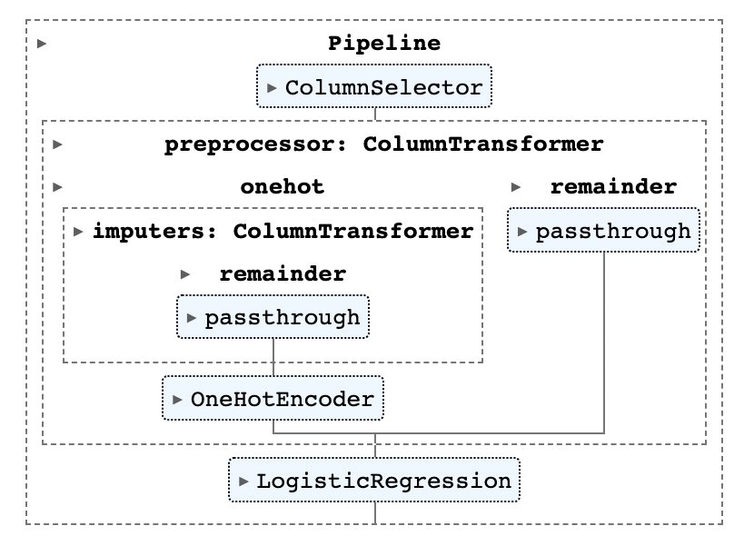
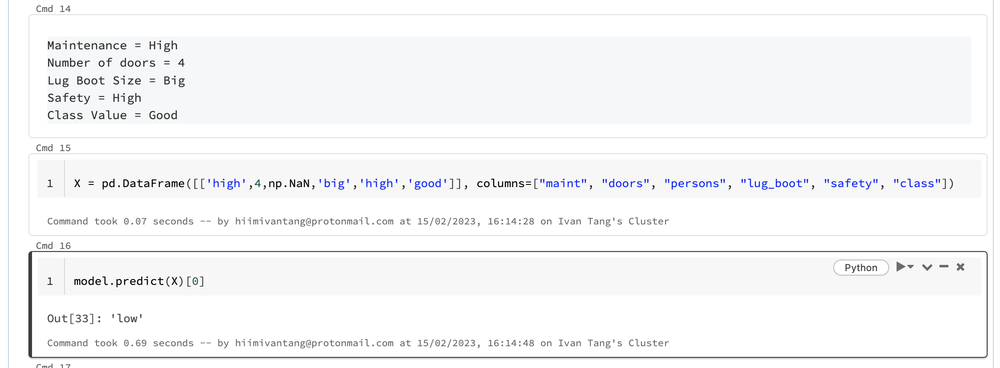

# Section 5


## Problem statement
Predict the car buying price based on other attributes with the possibility of missing values.

## Metadata
```
| class values

unacc, acc, good, vgood

| attributes

buying:   vhigh, high, med, low.
maint:    vhigh, high, med, low.
doors:    2, 3, 4, 5more.
persons:  2, 4, more.
lug_boot: small, med, big.
safety:   low, med, high.
```

## Gotchas

* The class (or label) for this dataset is supposed to be the `class` column which describes the car acceptability.
However, the problem now is to train a model $based on other attributes including the `class` column and predict the `buying` column 

* The `persons` column is missing from the input which we are supposed to predict the buying price.
The classification model needs to be able to handle missing input values.

* There are categorical columns that requires one hot encoding to represent them in integer representation so that our ML algorithm can understand them.
These columns are: 
  * `buying`
  * `maint`
  * `doors`
  * `lug_boot`
  * `safety`
  * `class`

## Solution outline

1. Load car evaluation dataset directly from the url with Pandas.
2. Create train, test, and validation datasets.
3. Define our objective function
4. Train our classification model and perform hyperparameter tuning
5. Select best model based on validation F1 score.


## Scikit learn pipeline of transforms with a final estimator (i.e. predictor)




## Results

